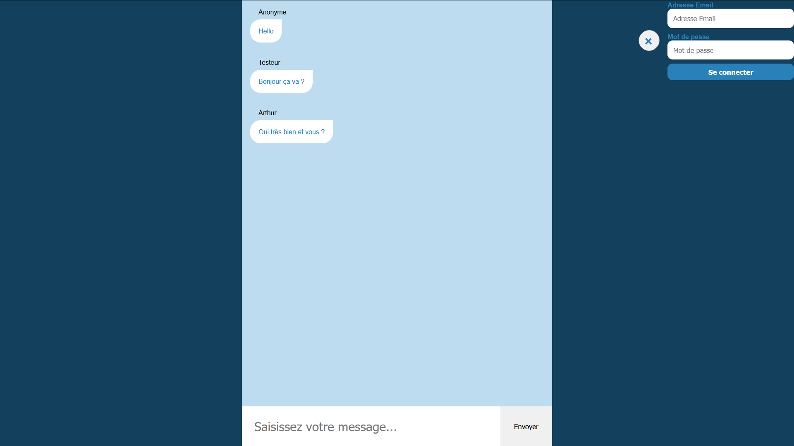

# Chat-room

Live chatroom built with React and Redux, running on a Node back-end.

Connect to the app and send a message as a user.

Front: React, Redux, Axios, Semantic UI.

Back: Node.js, Express.js, Socket.io.



## How to launch
Clone the repository then execute command below in each folder

Front:
```
yarn
yarn start
```

Back:
```
yarn
yarn start
```

## Login

Mail / Password
```
arthas@war.io
jennifer
```

```
arthur@kaamelott.graal
guenièvre
```

```
test@go.io
gotest
```
